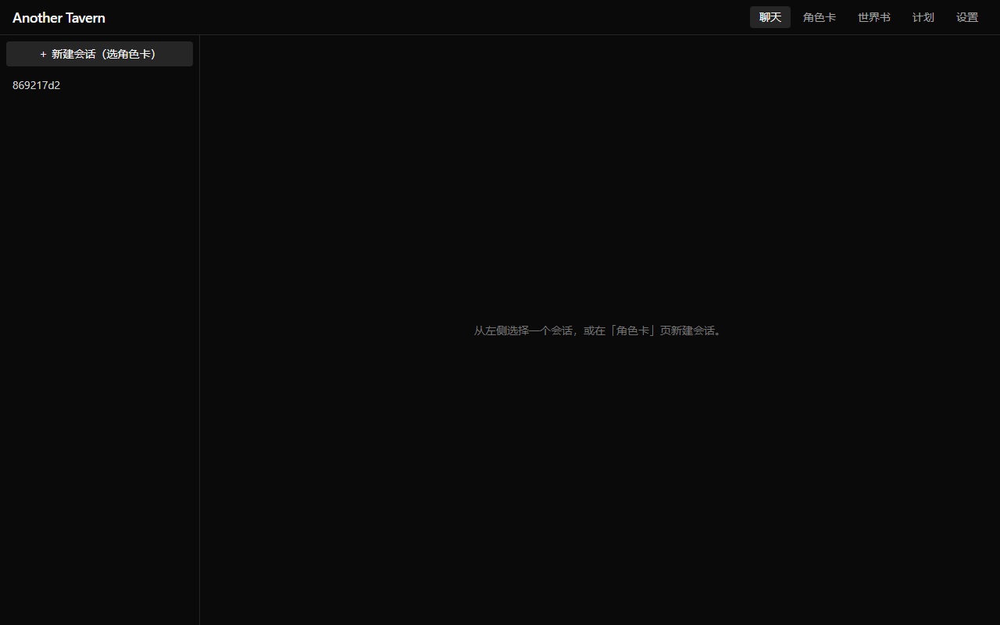

# Another Tavern

<p align="center">
  
</p>

开源、自托管优先的 AI 角色扮演框架，定位为 [SillyTavern](https://github.com/SillyTavern/SillyTavern)（下称 ST）的平替。
核心价值在**提示词组装引擎**：把角色卡、用户人设、世界书（lorebook）、聊天历史在 token 预算内按规则组装成最终请求——UI 只是皮，引擎是灵魂。

MIT 许可。与 ST 的兼容仅限文件格式层面（角色卡 V2/V1 JSON+PNG、预设 JSON、世界书 JSON）——本仓库不包含任何 ST（AGPL-3.0）源码，详见 [LICENSE](./LICENSE)。

## 快速开始

### 便携包（推荐，需 Node ≥ 22.5）

从 [Releases](../../releases) 下载 `another-tavern-v*-node22.zip`，解压后：

- Windows：双击 `start.cmd`（自动起服务并打开浏览器）
- Linux / macOS：`./start.sh`

数据库与全部数据写在解压目录 `app/data/` 下，随目录移动。

### Docker

```bash
docker build -t another-tavern .
docker run -p 3001:3001 -v another-tavern-data:/app/data another-tavern
```

浏览器打开 `http://localhost:3001`。数据卷 `/app/data` 保存 SQLite 数据库（聊天记录与设置）。

### 源码开发

```bash
pnpm install
pnpm dev        # server:3001 + web:5173（/api 自动代理）
```

要求 Node ≥ 22.5（内置 `node:sqlite` 驱动）。

## 当前状态

当前预览版本：`v0.3.0-beta.1`。本版本包含群聊核心链路，自动多轮仍未实现。

- **M0** 脚手架：pnpm workspace + 三包骨架 + 工具链（TypeScript strict / vitest / eslint / prettier）✅
- **M1** 规格文档：`docs/` 三份规范，是实现的**唯一依据**（见下表）✅
- **M2** 引擎：角色卡解析、世界书引擎、tokenizer、Prompt 组装器（`packages/engine`）✅
- **M3** 后端与端到端链路：SQLite(Drizzle 迁移) + REST API + SSE 流式对话 ✅
- **M4** 数据地基：组装计划、世界书管理表与导入、生态解析器、计划感知组装 ✅
- **M5** 正式前端核心：会话/聊天/角色卡/设置四页 + zustand 状态 + API client ✅
- **M6** 世界书与预设 UI：世界书管理/条目编辑/挂载、组装计划编辑器、ST 导入、prompt 可观测 ✅
- **M7** 群聊前端核心：群聊创建、成员设置、发言角色选择、消息身份展示 ✅（自动多轮暂未实现）

## 规格文档（docs/）

| 文档                                                   | 内容                                                                  | 状态   |
| ------------------------------------------------------ | --------------------------------------------------------------------- | ------ |
| [docs/cards-spec.md](./docs/cards-spec.md)             | 角色卡规范：V2 字段全表、PNG/JSON 容器、V1 兼容、扩展保留策略         | 评审中 |
| [docs/prompt-assembly.md](./docs/prompt-assembly.md)   | Prompt 组装规范：段序、token 预算与裁剪、tokenizer 策略、端到端示例   | 评审中 |
| [docs/world-info-spec.md](./docs/world-info-spec.md)   | 世界书引擎规范：激活/排序/预算/递归规则、与组装器的 TS 接口           | 评审中 |
| [docs/settings-spec.md](./docs/settings-spec.md)       | 设置与采样参数规范：资源模型、采样 7 键契约、发送白名单、API 与 UI    | 已实现 |
| [docs/chat-stream-spec.md](./docs/chat-stream-spec.md) | 流式聊天与消息状态：SSE 事件、失败/取消、原消息重试与 prompt 历史规则 | 已实现 |
| [docs/group-chat-spec.md](./docs/group-chat-spec.md)   | 群聊第一阶段提案：成员模型、发言调度、Swap Prompt、SSE、迁移与测试    | 实施中 |

## 架构分层

业务依赖方向严格单向：`web → server → engine`，禁止反向依赖。`packages/sse` 是无网络、无 UI、无数据库的纯 SSE 文本解析工具，供 web 与 server 共同依赖，不参与业务层调用。

```text
┌──────────────────────────────────────────────────┐
│  packages/web                                    │
│  Vite + React + Tailwind SPA                     │
│  只与 server 通信（HTTP / SSE），不碰引擎与数据库 │
└───────────────┬──────────────────────────────────┘
                │ HTTP / SSE
┌───────────────▼──────────────────────────────────┐
│  packages/server                                 │
│  Hono API + SSE 流式 + SQLite 存储（Drizzle ORM） │
│  只通过 engine 完成组装逻辑，不复制引擎实现       │
└───────────────┬──────────────────────────────────┘
┌───────────────▼──────────────────────────────────┐
│  packages/engine                                 │
│  无头引擎：角色卡解析 · 世界书引擎 ·              │
│  Prompt 组装器 · tokenizer 接口                   │
│  禁令：零 UI 依赖、不发网络请求、不碰数据库       │
└──────────────────────────────────────────────────┘
```

## 各包职责

| 包                | 职责                                                                                                                            | 当前状态                                                               |
| ----------------- | ------------------------------------------------------------------------------------------------------------------------------- | ---------------------------------------------------------------------- |
| `packages/engine` | 无头引擎：角色卡（ST V2，PNG 内嵌 JSON）解析、世界书引擎、Prompt 组装器、tokenizer 接口。零 UI 依赖、不发网络请求、不碰数据库。 | M2–M4：计划感知组装、群聊 prompt 与 speaker 调度已实现                 |
| `packages/sse`    | 纯 SSE 文本解析：LF/CRLF、跨 chunk、多行 `data:` 与 EOF 刷出；供 web 与 server 复用。                                           | M8：共享协议解析                                                       |
| `packages/server` | Hono API + SSE 流式 + SQLite 存储（Drizzle ORM），调用 engine。                                                                 | M3–M6：会话、设置、群聊成员/策略与 SSE 生成链路已实现                  |
| `packages/web`    | Vite + React + Tailwind SPA，只跟 server 通信。                                                                                 | M5–M7：正式聊天 UI、Zustand 状态、群聊创建/成员设置/speaker 选择已实现 |

## 技术栈（锁定，不得替换）

- pnpm workspaces monorepo；TypeScript（strict 全开，根 `tsconfig.base.json` 统一继承）；vitest；eslint + prettier
- server：Hono + Drizzle ORM（SQLite，驱动为 Node 内置 `node:sqlite` + drizzle sqlite-proxy；迁移由 drizzle-kit 生成）
- web：Vite + React + Tailwind（禁用 Next.js 与一切组件库）
- 运行时 Node ≥ 22.5（M3 决策：`node:sqlite` 内置驱动），保持与 Bun 兼容（不使用 Bun 特有 API）

## 常用命令

| 命令                                         | 作用                                                                                            |
| -------------------------------------------- | ----------------------------------------------------------------------------------------------- |
| `pnpm install`                               | 安装依赖                                                                                        |
| `pnpm dev`                                   | **一条命令同时启动 server(:3001) 与 web(:5173)**（并行）                                        |
| `pnpm build`                                 | 依次构建全部包（engine → server → web，按拓扑顺序）                                             |
| `pnpm test`                                  | 运行全部 vitest 测试                                                                            |
| `pnpm typecheck`                             | 对全部包运行 `tsc --noEmit`（含测试文件）                                                       |
| `pnpm lint`                                  | ESLint 检查全部源码                                                                             |
| `pnpm format`                                | Prettier 格式化（提交前先跑一遍）                                                               |
| `pnpm format:check`                          | Prettier 格式校验                                                                               |
| `pnpm --filter @another-tavern/server start` | 仅启动 server（需先 build；默认仅监听 `127.0.0.1`；`HOST` / `PORT` / `DB_PATH` 环境变量可覆盖） |
| `pnpm --filter @another-tavern/web dev`      | 仅启动 web 开发服务器                                                                           |

构建产物位于各包 `dist/`（web 为 `packages/web/dist/`，可直接静态部署）。
server 数据库默认写入 `packages/server/data/app.db`（`DB_PATH` 可覆盖），迁移文件在 `packages/server/drizzle/`。

## 手动冒烟测试（M7 全链路）

前置：Node ≥ 22.5；一个 OpenAI 兼容上游（如任何暴露 `/chat/completions` 的服务）与它的 API key。

1. **启动**：仓库根执行 `pnpm dev`——server 跑在 `http://localhost:3001`，web 跑在 `http://localhost:5173`（`/api` 自动代理到 3001）。
2. **导入角色卡**：打开 `http://localhost:5173` → 顶部「角色卡」页 → 把 V2 PNG/JSON 卡**拖入虚线区**（或点"或选择文件导入"）→ 状态行显示"已导入：<卡名>"。没有现成卡时，可把 `packages/server/src/app.test.ts` 里的 `SAMPLE_CARD` JSON 存成 `.json` 文件使用。
3. **新建会话**：在卡列表点「开始聊天」→ 自动跳到聊天页，卡片的 `first_mes` 已作为开场消息显示；左侧栏出现该会话。
4. **配置上游**：「设置」页填 baseUrl / API key / 模型名 → 保存（key 不回显明文；留空即保留）。同页可设 7 个采样参数：temperature / top_p / max_tokens / frequency_penalty / presence_penalty / stop / seed（留空 = 不发送该参数；契约见 [docs/settings-spec.md](./docs/settings-spec.md)）。
5. **流式对话**：聊天页输入消息 → Enter 发送 → 助手气泡**逐 token 出字**。
6. **编辑 / swipe / 重新生成**：点消息下「编辑」改内容并保存；assistant 气泡下 `← 1/2 →` 切换候选（点「→ 重新生成」生成新候选）；「重新生成」按钮可重生成最后一条回复。
7. **刷新保持**：刷新页面 → 会话列表仍在、上次打开的会话自动恢复、历史消息完整。
8. **采样生效**：设置页改 `temperature`（如 0.1）等采样参数（7 键全集与发送白名单见 [docs/settings-spec.md](./docs/settings-spec.md)）→ 保存 → 继续对话，观察回复变化；或用 `curl` 对比上游收到的请求体（白名单外的 sampling 键不会发送）。

群聊核心链路的自动化与浏览器冒烟验收见 [docs/group-chat-e2e.md](./docs/group-chat-e2e.md)。

## 安全说明

- **API key 与聊天记录以明文存储在本地 SQLite**（`data/app.db`，Docker 中为 `/app/data`）——这是单机自托管工具的刻意取舍：数据不出本机。
- 该文件包含你的上游 API key，**不要**把它提交到任何仓库、发给别人或放进截图。
- 服务默认监听 `127.0.0.1:3001`（仅本机）。如确实需要局域网或容器外访问，须显式设置 `HOST=0.0.0.0`；Docker 镜像已预设该值以支持 `-p 3001:3001`。开放后请勿在不受信任的网络中直接暴露，或使用防火墙/反向代理 + 认证限制访问。
- 上传的角色卡/世界书文件有大小上限（20MB / 5MB）并在解析前做格式校验。

## 与 SillyTavern 的功能差异

本仓库与 ST 的兼容仅限**文件格式**（V2 角色卡、预设 JSON、世界书 JSON 的导入）；不包含任何 ST 源码。当前差异：

- 暂不支持：群聊自动多轮（第一阶段已完成数据地基、引擎调度、server 生成链路与前端核心 UI，规格见 [docs/group-chat-spec.md](./docs/group-chat-spec.md)）、正则脚本、世界书正则 key、Timed Effects、Inclusion Group、向量检索、Outlet、作者注频率、Prompt Manager 拖拽（用上下移按钮替代）
- 世界书插入位置仅实现 beforeChar / afterChar / atDepth（其余可选但不注入，字段保留）
- 组装段序由「组装计划」编排（含上移/下移与自定义槽文本），非 ST 的自由拖拽列表
- 完整对照见 `docs/world-info-spec.md` §9 与 `docs/cards-spec.md` §1（不支持格式清单）

## 面向 Agent 的开发规则

见 [AGENTS.md](./AGENTS.md)——任何 Agent 在本仓库工作前必须先完整阅读 README、AGENTS.md 与 `docs/` 下全部文档。
